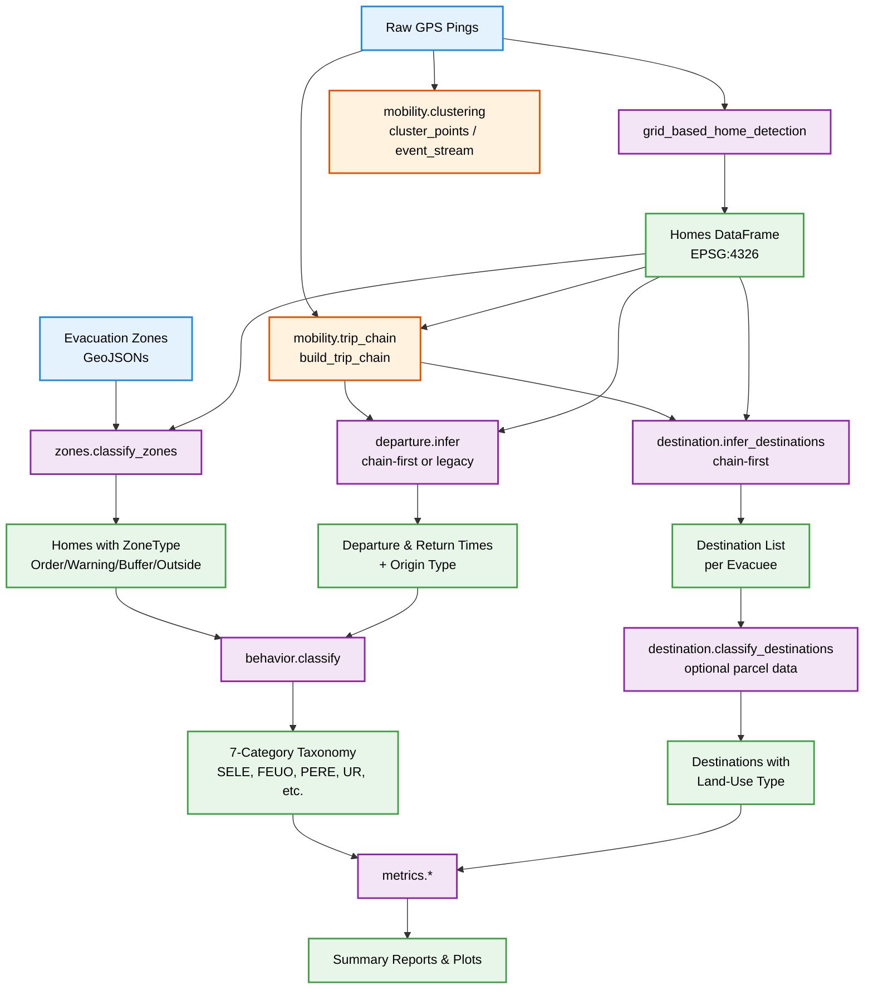
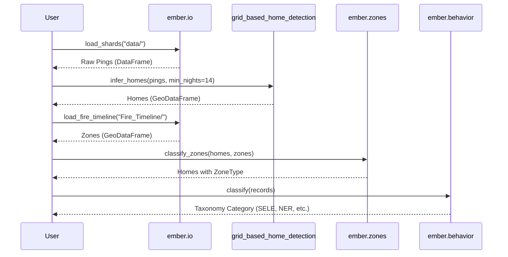

# EMBER Package Architecture

The `ember` package is a focused, modular library for inferring wildfire evacuation behavior from GPS data. It abstracts the complex spatiotemporal math, taxonomy trees, and gap metrics into clean Python functions.

## High-Level Pipeline

## Module Definitions: Inputs & Outputs

### 1. `ember.io`
**Purpose**: Standardizes all spatial and tabular data loading, automatically handling CRS transformations to EPSG:4326 (WGS84).
*   **Inputs**: Paths to `home.csv`, `evacuation_metrics.csv`, MongoDB `.pkl` shards, or directory of `Fire_Timeline` GeoJSONs.
*   **Outputs**: Cleaned `pandas.DataFrame` or `geopandas.GeoDataFrame`.

### 2. `grid_based_home_detection` (External PyPI Package)
**Purpose**: Infers proxy home locations from nighttime GPS pings using a localized grid-snapping approach.
*   **Inputs**: `pings` DataFrame (requires `user_id`, `latitude`, `longitude`, `datetime`).
*   **Outputs**: `gpd.GeoDataFrame` of home locations with `num_nights` and `stay_time`.

### 3. `ember.zones`
**Purpose**: Spatially joins resident homes to dynamic, timestamped fire evacuation perimeters.
*   **Inputs**: `homes` (from `grid_based_home_detection`) and `fire_zones` (from `io.py`).
*   **Outputs**: The `homes` dataframe with appended columns: `ZoneType` (Order, Warning, Buffer, Outside) and `OrderStart`.

### 4. `ember.departure`
**Purpose**: Identifies the timestamps when a resident left their home spatial cluster ($T_{dep}$) and returned ($T_{ret}$).
*   **Inputs**: `pings` DataFrame and `order_start` timestamp.
*   **Outputs**: Tuple `(T_dep, T_ret)` for each user.

### 5. `ember.behavior`
**Purpose**: The core deterministic classifier that maps timing and spatial traits into the 7-category taxonomy.
*   **Inputs**: The merged DataFrame containing `ZoneType`, `DepartureDate`, `ReturnDate`, and `OrderStart`.
*   **Outputs**: A `pd.Series` of Categorical strings (e.g., `'SELE'`, `'FEUO'`, `'NER'`).

### 6. `ember.metrics`
**Purpose**: Generates publication-ready metrics and plots, natively handling timezone-aware datasets.
*   **Inputs**: The classified records DataFrame.
*   **Outputs**: Aggregated DataFrames (Compliance Rates, DEDI) and matplotlib plots (`plot_departure_curve`, `plot_evacuation_composition`, `plot_temporal_heatmap`, `plot_return_timeline`, `plot_delay_map`).

### 7. `ember.mobility.clustering`
**Purpose**: Generalized, reusable incremental clustering engine shared by all mobility modules.
*   **Inputs**: Chronological GPS pings with `latitude`, `longitude`, `datetime`.
*   **Outputs**: Stable `ClusterSummary` records (cluster id, centroid, start/end, dwell, point count) and optional engine events for streaming use.

### 8. `ember.mobility.trip_chain`
**Purpose**: Extracts full stop chains with intermediate-stop tracking and role labeling.
*   **Inputs**: User pings and optional home anchors.
*   **Outputs**: Ordered stop sequences with `seq_idx`, stop location/time/dwell, distance-from-home/previous-stop, and `stop_role` (`home`, `intermediate`, `destination`, `overnight`, `return`).

### 9. `ember.contracts`
**Purpose**: Canonical schema contracts and lightweight validators used across mobility/departure/destination flow.
*   **Inputs**: DataFrames for pings, homes, trip chains, and destinations.
*   **Outputs**: Validation/canonicalization helpers (`validate_columns`, `canonicalize_columns`), plus reusable schema specs.

### 10. `ember.activities`
**Purpose**: Backward-compatible activity APIs built on top of the shared clustering/trip-chain layer.
*   **Inputs**: Chronological GPS pings with `latitude`, `longitude`, `datetime`.
*   **Outputs**: `ActivityCluster` namedtuples and `find_origin()` for home-vs-activity origin resolution.

### 11. `ember.destination`
**Purpose**: Infers evacuation destinations from stop chains or nightly-stop tables and optionally classifies them by land-use type.
*   **Inputs**: Stop-chain or nightly stop records and home locations. Optionally, parcel/land-use GeoDataFrame.
*   **Outputs**: Per-evacuee destination list with distances. With parcel data: destination type classification (residential, hotel, commercial, public, road, other).

### 12. `ember.mobility.routes`
**Purpose**: Route-model integration interfaces built on top of stop-chain outputs.
*   **Inputs**: Canonical trip-chain artifacts.
*   **Outputs**: Sequential trip legs and route-candidate hooks via pluggable strategy callbacks (neutral default if no strategy is provided).

## Configurable Hyperparameters

EMBER is designed to give researchers full control over the physical and temporal thresholds that define an evacuation. Every core function exposes these as keyword arguments. 

Here are the key hyperparameters you can manipulate:

*   **Zone Buffering (`buffer_distance`)**: In `ember.zones.classify_zones`, you can adjust the physical width of the Shadow Evacuation zone (default is `2000.0` meters).
*   **Home Inference Grid (`grid_cell_size`)**: In `ember.ghost.infer_homes`, you can change the snapping resolution (default `50.0` meters).
*   **Residency Thresholds (`min_nights`, `min_stay_time`)**: In `ghost.py`, you can strictly define who counts as a resident vs. a transient visitor (defaults strictly to `14` nights).
*   **Evacuation Duration Thresholds (`min_evac_days`, `min_evac_days_buffer`)**: In `ember.pipeline.infer_metrics`, define the required consecutive days spent away from home overnight for a resident to be flagged as a potential evacuee. Can differ between in-zone and buffer-zone.
*   **Trip Detection Radii (`home_radius`, `away_radius`)**: In `ember.departure.infer`, define what physical distance constitutes "leaving the neighborhood" (default `away_radius=1000.0`).
*   **Nighttime Windows (`nighttime_start`, `nighttime_end`)**: In `ghost.py`, define when a user must be present to count as dwelling at home.
*   **Activity Clustering Radius (`R_a`)**: In `ember.activities.incremental_cluster`, the spatial threshold for grouping GPS pings into an activity (default `200.0` metres).
*   **Activity Duration Threshold (`T_a`)**: Minimum stay at a location to qualify as an activity (default `5min`).
*   **Max Ping Gap (`max_gap_s`)**: In `ember.mobility.clustering.IncrementalClusterConfig`, splits clusters when temporal gaps are too large.
*   **Trip-Chain Destination Dwell (`destination_min_dwell_s`)**: Minimum dwell to promote an away stop from `intermediate` to `destination`.
*   **Trip-Chain Merge Rules (`merge_nearby_stops`, `merge_distance_m`, `merge_gap_s`)**: Controls split/merge behavior for adjacent stops under GPS jitter.
*   **Destination Merge Distance (`merge_distance_km`)**: In `ember.destination.infer_destinations`, successive overnight stops within this distance are merged into one destination (default `0.4` km).
*   **Home Buffer (`home_buffer_m`)**: In `ember.destination.infer_destinations`, stops within this distance of home are excluded (default `400` m).

## Future Enhancements
*   **Route Modeling (network-backed)**: `ember.mobility.routes` now provides neutral interfaces; next step is adding project-specific strategy implementations and network-graph calibration.

